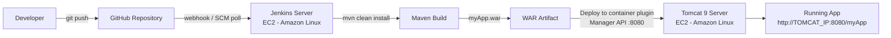

# DevOps CI/CD Pipeline Using Jenkins, GitHub, Maven & Tomcat

An end-to-end CI/CD pipeline for a Java web application. A push to GitHub triggers Jenkins, which checks out the latest code, builds it with Maven, packages a WAR file, and deploys it automatically to an Apache Tomcat server.

**Repository:** https://github.com/srush98/MyApp.git

---

## Table of Contents

1. [Architecture](#architecture)
2. [Technologies and Versions](#technologies-and-versions)
3. [Infrastructure](#infrastructure)
4. [Setup Steps](#setup-steps)
5. [Jenkinsfile](#jenkinsfile)
6. [Triggering the Pipeline](#triggering-the-pipeline)
7. [Verification](#verification)

---

## Architecture



**Flow:** Developer → GitHub → Jenkins → Maven build → WAR file → Tomcat

| Stage | What happens |
|---|---|
| Source | Developer pushes code to the GitHub repository |
| Trigger | A GitHub webhook (or SCM polling) notifies Jenkins |
| Checkout | Jenkins pulls the latest code from the branch |
| Build | Maven runs `clean install` and produces a WAR in `target/` |
| Archive | The WAR is stored as a Jenkins build artifact |
| Deploy | The Deploy to container plugin sends the WAR to Tomcat's Manager app |
| Validate | The application is reachable at `/myApp` on the Tomcat server |

---

## Technologies and Versions

| Tool | Version / Notes |
|---|---|
| Java | 21 (Amazon Corretto) |
| Maven | 3.x (3.9.x, installed automatically via Jenkins Tools) |
| Apache Tomcat | 9.x |
| Jenkins | LTS, installed from the official `redhat-stable` repository |
| Git / GitHub | Source control and hosting |
| OS | Amazon Linux 2023 on AWS EC2 |

**Jenkins plugins used:** Git, Pipeline, GitHub, Maven Integration, Deploy to container.

---

## Infrastructure

Two EC2 instances are used, one for CI and one for hosting the application.

| Instance | Purpose | Inbound ports |
|---|---|---|
| Jenkins server | Builds and deploys | 22, 8080 |
| Tomcat server | Runs the application | 22, 8080 (the Jenkins security group) |

Both instances live in the same VPC, so Jenkins deploys to Tomcat using Tomcat's **private IP**.

---

## Setup Steps

### 1. Prepare the repository

```bash
git clone https://github.com/srush98/MyApp.git
cd MyApp
```

The project is a Maven web application (`<packaging>war</packaging>` in `pom.xml`).

### 2. Launch and configure the Jenkins server

1. Launch an EC2 instance (Amazon Linux 2023) with the security group above.
2. SSH in and install the prerequisites:

   ```bash
   sudo yum update -y
   sudo yum install -y java-21-amazon-corretto-devel git maven
   java -version && mvn -version && git --version
   ```

3. Install and start Jenkins:

   ```bash
   sudo wget -O /etc/yum.repos.d/jenkins.repo https://pkg.jenkins.io/rpm-stable/jenkins.repo
   sudo yum install -y jenkins
   sudo systemctl daemon-reload
   sudo systemctl start jenkins
   sudo systemctl status jenkins
   ```

4. Retrieve the initial admin password:

   ```bash
   sudo cat /var/lib/jenkins/secrets/initialAdminPassword
   ```

5. Open `http://<JENKINS_IP>:8080`, install the suggested plugins, and create the admin user.
6. Install the additional plugins: **Maven Integration** and **Deploy to container**.
7. Under **Manage Jenkins → Tools**, register:
   - **JDK:** name `JDK21`, `JAVA_HOME=/usr/lib/jvm/java-21-amazon-corretto`
   - **Maven:** name `Maven3` (install automatically, 3.9.x)

### 3. Launch and configure the Tomcat server

1. Launch a second EC2 instance with the Tomcat security group.
2. Install Java and Tomcat 9:

   ```bash
   sudo yum install -y java-21-amazon-corretto
   cd /opt
   sudo wget https://downloads.apache.org/tomcat/tomcat-9/v9.0.122/bin/apache-tomcat-9.0.x.tar.gz
   sudo tar -xzf apache-tomcat-9.0.X.tar.gz
   sudo mv apache-tomcat-9.0.X tomcat
   chmod +x /opt/tomcat/bin/*.sh
   ```

   Replace `9.0.X` with the current 9.0 release.

3. Create the deployment user in `/opt/tomcat/conf/tomcat-users.xml`:

   ```xml
   <role rolename="manager-gui"/>
   <role rolename="manager-script"/>
   <user username="deployer" password="<STRONG_PASSWORD>" roles="manager-gui,manager-script"/>
   ```

4. Allow remote access to the Manager app by commenting out the `RemoteAddrValve` in both of these files:
   - `/opt/tomcat/webapps/manager/META-INF/context.xml`
   - `/opt/tomcat/webapps/host-manager/META-INF/context.xml`

5. Start Tomcat as a non-root user:

   ```bash
   sudo /opt/tomcat/bin/startup.sh
   ```

6. Confirm `http://<TOMCAT_IP>:8080` and `http://<TOMCAT_IP>:8080/manager/html` load.

### 4. Store the Tomcat credentials in Jenkins

**Manage Jenkins → Credentials → Global → Add Credentials**

- Kind: Username with password
- Username: `deployer`
- ID: `tomcat-deployer`

### 5. Create the Jenkins job

**Option A: Maven job (freestyle style)**

- Source Code Management: Git, `https://github.com/srush98/MyApp.git`, branch `*/main`
- Build: Root POM `pom.xml`, goals `clean install`, Maven version `Maven3`
- Post-build: **Deploy war/ear to a container**
  - WAR/EAR files: `**/*.war`
  - Context path: `myApp`
  - Container: Tomcat 9.x Remote, credentials `tomcat-deployer`, URL `http://<TOMCAT_PRIVATE_IP>:8080`

**Option B: Pipeline job (Pipeline as code)**

- New Item → Pipeline
- Definition: Pipeline script from SCM, Git, `https://github.com/srush98/MyApp.git`, branch `*/main`
- Script Path: `Jenkinsfile`

---

## Jenkinsfile

Located at the repository root:

```groovy
pipeline {
    agent any

    tools {
        maven 'Maven3'
        jdk 'JDK21'
    }

    triggers {
        githubPush()
    }

    stages {
        stage('Checkout') {
            steps {
                checkout scm
            }
        }

        stage('Build') {
            steps {
                sh 'mvn clean install'
            }
        }

        stage('Archive WAR') {
            steps {
                archiveArtifacts artifacts: 'target/*.war', fingerprint: true
            }
        }

        stage('Deploy to Tomcat') {
            steps {
                deploy adapters: [tomcat9(credentialsId: 'tomcat-deployer',
                                          path: '',
                                          url: 'http://<TOMCAT_PRIVATE_IP>:8080')],
                       contextPath: 'myApp',
                       war: 'target/*.war'
            }
        }
    }

    post {
        success { echo 'Pipeline succeeded: app deployed to Tomcat' }
        failure { echo 'Pipeline failed: check the stage logs' }
    }
}
```

---

## Triggering the Pipeline

**GitHub webhook (preferred)**

1. In the repo, go to **Settings → Webhooks → Add webhook**.
2. Payload URL: `http://<JENKINS_IP>:8080/github-webhook/`
3. Content type: `application/json`, event: *Just the push event*.

**SCM polling (fallback if Jenkins is not publicly reachable)**

Replace `githubPush()` in the `triggers` block with:

```groovy
triggers {
    pollSCM('H/2 * * * *')
}
```

Run the pipeline once manually after changing triggers so Jenkins registers them.

---

## Verification

1. Run the pipeline and confirm every stage is green in **Stage View**.
2. Confirm the WAR appears under **Build Artifacts**.
3. Open `http://<TOMCAT_IP>:8080/manager/html` and confirm `/myApp` is listed as running.
4. Open `http://<TOMCAT_IP>:8080/myApp` and confirm the application loads.
5. **Redeployment test:**
   - Edit a visible file (for example `src/main/webapp/index.html`).
   - Commit and push to `main`.
   - Confirm Jenkins starts a build automatically ("Started by GitHub push" in the console log).
   - Refresh the application URL and confirm the change is live.

---

## Author

Srushti Jiyani
